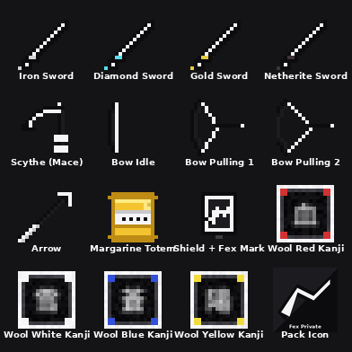

# Fex Private — Pack PvP Minecraft

Pack PvP completo cobrindo 3 versões do Minecraft:

| Plataforma | Versão | Pasta | Saída |
|---|---|---|---|
| Bedrock | 1.26.21 | `bedrock/` | `dist/FexPrivate_Addon_1.26.21.mcaddon` |
| Java | 1.21.4 | `java/1_21_4/` | `dist/FexPrivate_Java_1.21.4.zip` |
| Java | 1.8.9 (OptiFine) | `java/1_8_9/` | `dist/FexPrivate_Java_1.8.9.zip` |

Todos os assets visuais são **pretos e brancos com swoosh Fex próprio** (não usa marcas registradas).



---

## Conteúdo visual

- **Espadas** (madeira, pedra, ferro, ouro, diamante, netherite): lâmina **slim de 1px** (não obstrui visão durante PvP), preto com fio branco, pomo colorido por tier.
- **Mace → Foice**: lâmina curva preto/branco, cabo escuro com envoltórios brancos.
- **Arco**: 3 estágios de puxar — limbos pretos, corda branca.
- **Totem da Imortalidade → Margarina**: tablete amarelo com banda branca de marca genérica.
- **Armaduras** (couro, malha, ferro, ouro, diamante, netherite): placas pretas, bordas brancas, swoosh Fex no peito + capacete + leggings.
- **Escudo**: preto/branco com Fex swoosh ao centro.
- **Lãs (1.8.9 e 1.21.4)**: bordas brancas, miolo preto, kanji brilhante no meio. 16 cores, cada uma com um kanji temático:
  - White 雪 (neve), Orange 橙, Magenta 紫, Light Blue 空 (céu), Yellow 陽 (sol),
    Lime 緑, Pink 桃, Gray 灰, Light Gray 銀, Cyan 海 (mar), Purple 夜 (noite),
    Blue 蒼, Brown 土 (terra), Green 森 (floresta), Red 血 (sangue), Black 影 (sombra).

## Cliente PvP (Mods imbutidos)

| Mod | Bedrock | Java 1.8.9 | Java 1.21.4 |
|---|---|---|---|
| FPS Counter | Estimado via tickrate | Real | Real |
| CPS Counter | Aproximado (eventos de hit) | Real (LMB/RMB via LWJGL) | Real (LMB/RMB via GLFW) |
| Keystrokes WASD | Inferido por movimento | Real (KeyBindings) | Real (KeyBindings) |
| TNT Timer | ✅ (fuse + distância) | ✅ | ✅ |
| Hitbox | Partículas em volta | F3+B forçado | Mixin força hitbox sempre |
| Reach Indicator | Raycast (1–8m) | Distance ao alvo | Distance ao alvo |
| Coordenadas | ✅ | ✅ | ✅ |
| Editor de HUD | Modal Form (slider) | Drag-and-drop | Drag-and-drop |
| Menu de Pausa | Botão extra (UI) + `!fex` chat | Tecla RShift | Tecla RShift |
| Subpacks de cor | Padrão / Vermelho / Azul / Dourado | — | — |

### ⚠️ Aviso de cheats

Esse pack é marcado como **client** com features que servidores PvP normalmente classificam como cheat:

- **Reach Indicator** apenas EXIBE distância (não estende alcance), mas servidores podem marcar.
- **Hitbox forçada** é considerado mod visual aceitável na maioria dos lugares (equivalente a F3+B).
- **TNT Timer**, **CPS counter**, **Keystrokes** e **FPS** são considerados QoL/utility mods e aceitos em quase todo servidor.

**O pack NÃO faz**: kill aura, reach aumentado real, autoclick, fly, esp através de paredes. Foi escolhido manter no nível de **utility client** (estilo Badlion/Lunar) e não cheat client.

Mesmo assim: **NÃO É VENDÁVEL NA MARKETPLACE OFICIAL** da Microsoft/Mojang. Use apenas em servidores privados ou venda em canal próprio (Discord, etc).

---

## Instalação

### Bedrock 1.26.21

1. Compile os pacotes:
   ```bash
   bash fex-private/tools/build_packs.sh
   ```
2. Abra o arquivo `dist/FexPrivate_Addon_1.26.21.mcaddon` — o Minecraft Bedrock importa automaticamente RP + BP.
3. No mundo:
   - Em **Configurações de Mundo** → **Pacotes de Recursos** → ative `Fex Private — PvP`. Clique na engrenagem para escolher subpack (Padrão/Vermelho/Azul/Dourado).
   - Em **Pacotes de Comportamento** → ative `Fex Private — Client`. Ative "**Beta APIs**" / "**Experimental Gameplay**" se solicitado (necessário para Script API).
4. No jogo:
   - Digite `!fex` no chat → menu principal.
   - Ou use `/function fex/menu`.
   - Ou aperte ESC → botão **Fex Client** abaixo dos botões vanilla.

> **Sobre `min_engine_version`**: o manifest declara `[1, 21, 0]` (mínima testada). Se quiser fixar em 1.26.21 mesmo, edite `bedrock/resource_pack/manifest.json` → `min_engine_version: [1, 26, 21]`. Se o Minecraft reclamar de versão, abaixe esse número.

### Java 1.21.4

1. Compile: `bash fex-private/tools/build_packs.sh`
2. Copie `dist/FexPrivate_Java_1.21.4.zip` para `~/.minecraft/resourcepacks/` (ou `%appdata%\.minecraft\resourcepacks\` no Windows).
3. No Minecraft: **Options** → **Resource Packs** → mova o pack para o lado direito.

### Java 1.8.9

1. Mesmo procedimento. Requer **OptiFine 1.8.9** para CIT (custom items via NBT).
2. Pasta: `~/.minecraft/resourcepacks/FexPrivate_Java_1.8.9.zip`.

---

## Compilação dos mods Java

Os resource packs sozinhos só mudam **texturas**. Para ter FPS/CPS/Keystrokes/TNT Timer/Hitbox/Reach você precisa **também** instalar o mod cliente.

### Fabric 1.21.4

Requer **JDK 21**.

```bash
cd fex-private/java/mods/fabric_1_21_4
gradle wrapper --gradle-version 8.10   # primeira vez
./gradlew build
# JAR fica em build/libs/fex-private-fabric-1.0.0.jar
```

Copie o JAR para `~/.minecraft/mods/` num perfil Fabric 1.21.4 com **Fabric API**.

### Forge 1.8.9

Requer **JDK 8** (ForgeGradle 1.2 NÃO compila com JDK 11+).

```bash
cd fex-private/java/mods/forge_1_8_9
gradle wrapper --gradle-version 2.14.1   # primeira vez
./gradlew setupDecompWorkspace            # demora 10–20 min
./gradlew build
# JAR fica em build/libs/fex-private-forge-1.8.9-1.0.0.jar
```

Copie o JAR para `~/.minecraft/mods/` num perfil Forge 1.8.9 (versão 11.15.1.2318+).

---

## Pipeline de texturas

Todas as PNGs são **geradas proceduralmente** em Python:

```bash
python3 fex-private/tools/gen_textures.py    # base textures
python3 fex-private/tools/gen_subpacks.py    # variantes Bedrock subpack
```

Para customizar:
- Cores: edite `BLACK`, `WHITE`, etc no topo de `tools/gen_textures.py`.
- Swoosh Fex: edite `fex_mark()` em `tools/gen_textures.py`.
- Kanji das lãs: edite `WOOL_KANJI` em `tools/gen_textures.py`.

> **Honesto**: as texturas são geradas por código, não pixel art à mão. Boas para iteração rápida, mas se for vender comercialmente, contrate um artista para passar por cima da arte das peças principais (espada, foice, armadura, totem).

---

## Estrutura do projeto

```
fex-private/
├── bedrock/
│   ├── resource_pack/        # manifest, textures, subpacks, UI
│   │   ├── manifest.json
│   │   ├── pack_icon.png
│   │   ├── textures/
│   │   │   ├── items/        # sword, scythe, bow, totem, etc
│   │   │   ├── blocks/       # wool with kanji
│   │   │   ├── models/armor/ # 12 layers
│   │   │   ├── item_texture.json
│   │   │   └── terrain_texture.json
│   │   ├── subpacks/         # default / red / blue / gold
│   │   └── ui/               # pause screen extension
│   └── behavior_pack/        # Script API "client"
│       ├── manifest.json
│       ├── scripts/main.js   # mods + menu
│       └── functions/fex/menu.mcfunction
├── java/
│   ├── 1_21_4/resource_pack/ # modern pack format 46
│   ├── 1_8_9/resource_pack/  # legacy pack format 1
│   └── mods/
│       ├── fabric_1_21_4/    # Fabric mod source
│       └── forge_1_8_9/      # Forge mod source
├── tools/
│   ├── gen_textures.py       # main texture generator
│   ├── gen_subpacks.py       # Bedrock subpack variants
│   └── build_packs.sh        # zips all 4 outputs
├── dist/                     # build output (gitignored)
└── README.md
```

## Licença

Proprietário — **Fex Private**. Nenhuma marca registrada de terceiros foi usada nas texturas.
